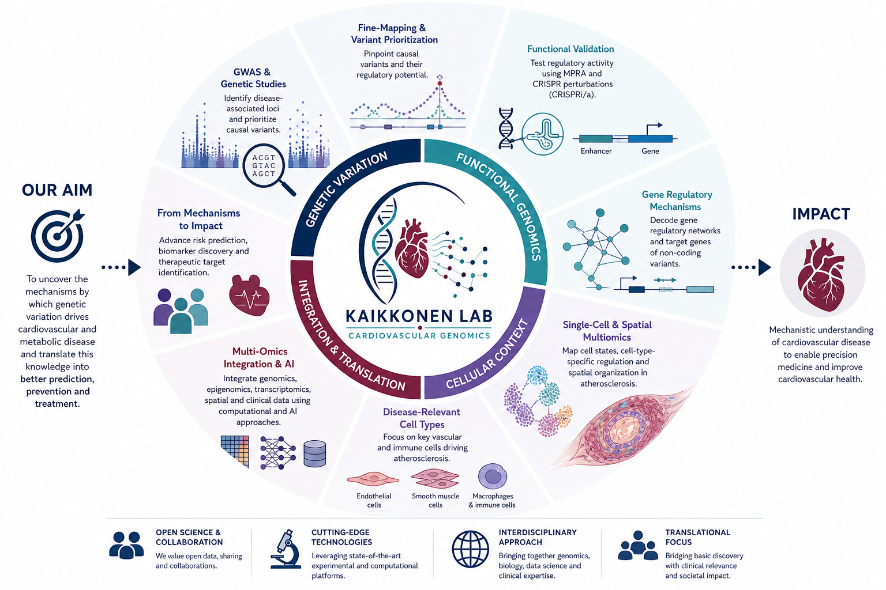
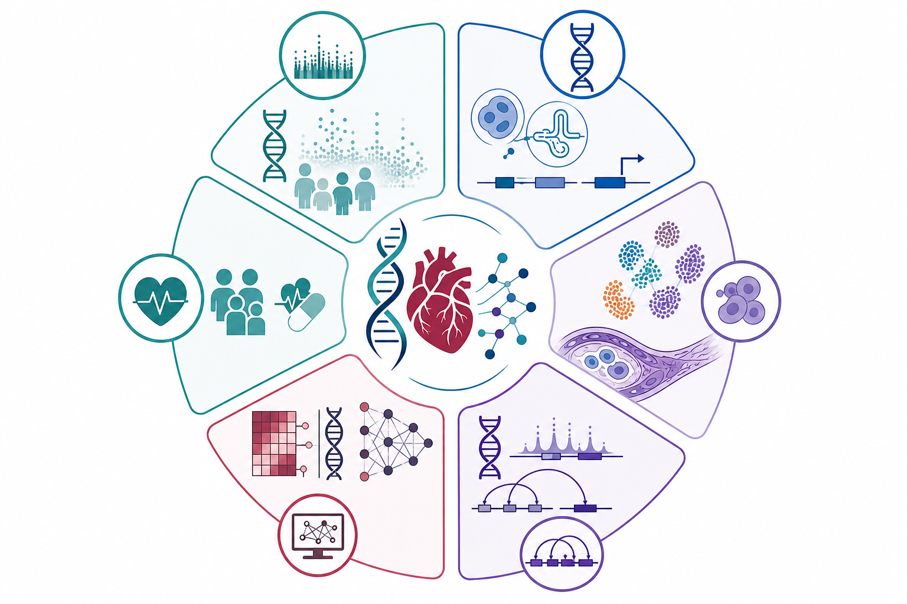
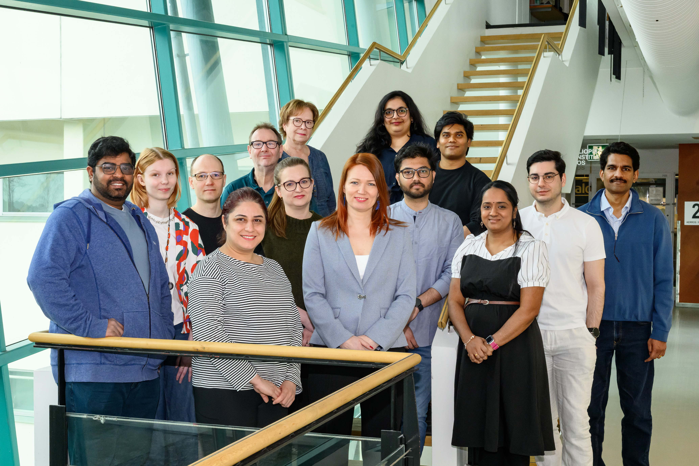

<section class="home-open">
  

    <h1 class="home-title">Regulatory genomics of cardiovascular disease</h1>

    

      The Kaikkonen Lab investigates how genetic and epigenomic regulatory mechanisms shape atherosclerotic cardiovascular disease and cardiometabolic risk. We connect disease-associated genetic variation to regulatory mechanisms, cellular states, and biological function using functional genomics, single-cell technologies, multi-omics, and computational biology.
    

    

      <a href="research/">Explore research</a>
      <a class="secondary" href="projects/">View projects</a>
      <a class="secondary" href="team/">Meet the team</a>
    

  

  

    

    

    
♥

    
🧬

    
🔬

    
🧫

    
📊

    
🎯

  

</section>

Discovery pipeline

A connected path from genetics to cardiovascular translation

  

    
🧬

    <strong>Genetic risk</strong>
    GWAS loci and disease-associated variants
  

  

    
🎯

    <strong>Prioritization</strong>
    Causal regulatory variant discovery
  

  

    
🔬

    <strong>Validation</strong>
    MPRA, CRISPR, and cellular models
  

  

    
🧫

    <strong>Cell states</strong>
    Single-cell and spatial disease biology
  

  

    
🫀

    <strong>Translation</strong>
    Mechanisms, prediction, and therapeutic insight
  

Explore

Learn more about our work

  

    
    

      <h3>Research</h3>
      
Explore the lab’s scientific themes in cardiovascular genomics, gene regulation, epigenomics, and variant interpretation.

      <a href="research/">Explore research →</a>
    

  

  

    
    

      <h3>Projects</h3>
      
Browse ongoing and foundational projects linking genetic discovery, regulatory function, cellular context, and translation.

      <a href="projects/">Browse projects →</a>
    

  

  

    
    

      <h3>Team</h3>
      
Meet the interdisciplinary researchers working across cardiovascular biology, functional genomics, and computational analysis.

      <a href="team/">Meet the team →</a>
    

  

<section class="quote-panel">
  
“Science and everyday life cannot and should not be separated.”

  <cite>— Rosalind Franklin</cite>
</section>

